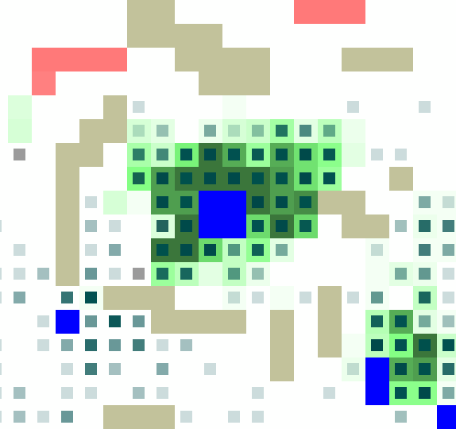

# Ant Colony Optimisation (ACO)
Thanks to my team and the powerful teammates ! ! !
   
<B>Welcome to our chosen project for Coding Weeks, the simulation of ant colony optimisation (ACO)!</B>

## Hello! Meet the team! (Members, Alphabetically Ordered)

- Chensheng Luo (délégué)
- Haonan Lin
- Mingshan Ye
- Raven Bast
- Yue Yang Oo

## Group Wisdom in Action! (Rules)

Our ACO simulation is a zero-user simulation, once the map is defined.   

Imagine ants trying to find food and bring it back to their nests.  
- In the real world, there are many obstacles that can hinder their movement.   
- Individual ants do not have much intelligence and can only move around randomly.  
- Once they find food, they will carry some of it and return back to the nest on the same path it came from before. Along the way, they will also deposit some pheromones to attract fellow ants. 
- The amount of pheromone deposited on each cell decreases proportionally with each move. 
- As time goes by, the pheromones previously deposited will evaporate, with the law *a(n+1) = (1-ratio_evaporation)×a(n) + deposit_pheromone*, where *deposit_pheromone* signifies the amount of pheromones deposited by ants currently on the cell.  
- The ant can move to all neighbouring cells, with the exception of obstacle cells or the cell just travelled most recently. The probability for the ant to move to any cell is in proportion to the amount of pheromones on that cell.    

## Define your map, and watch how the ants beat you! (Usage)

We provide two products, the Minimum Viable Product (MVP) and the Final Product (FP).  

### A Brief Introduction (MVP)

To better understand the rules, you can run the MVP by inserting `python .\MVP\gui_mvp.py` in the terminal, following which there is nothing left for you to do. A randomly generated map with already pre-defined parameters will then be displayed. You can watch the ants (small black dots) which will move to the food (red chunks) while navigating around the obstacles (brown chunks) and deposit pheromone (green background cells) on the way back to its nest.   

### I want to Define my Map! (FP)

THIS IS OUR FINAL PRODUCT!  

You can run the FP by inserting `python gui.py` in the terminal. You can then see a welcome screen, where you can choose between **generate a random map** or **define your own map**.  

- To randomly generate a map, click on **Generate Randomly**, then configure the parameters (the number of obstacle cells, the number of food cells etc.). Click on **Confirm**, and a map will be generated randomly according to your configuration parameters. Just sit back and enjoy the simulation!   
- To draw your own map, click on **Define Map and Generate**. Before clicking on **Draw a map using a canvas with size input below**, input your desired map size (left integer as x-value, right interger as y-value). This will allow you to draw your map by dragging and holding your cursor. You can change your cell brush by clicking on **Nest Brush**, **Food Brush**, **Obstacle Brush** and **Eraser** as well as change the parameters for the nest and food brushes. After drawing, click on **FINISH** and the simulation will start.  

## What Environment do I Need to Run the Simulation? (Computer Configurations)

It is easy. Equip your computer with `Python 3` and `pygame`!  

Simply run `pip install pygame` in the command terminal if you have not already installed it.

## How did we achieve this? (Development Log)

See the [Development Log](/development.md)

## What are the files? (Structure of the files)

See the [Structure](/structure.md)

## It is your turn! :D

**Feel free to play with your own map and enjoy yourself!**
